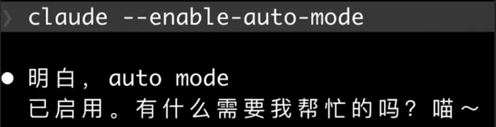
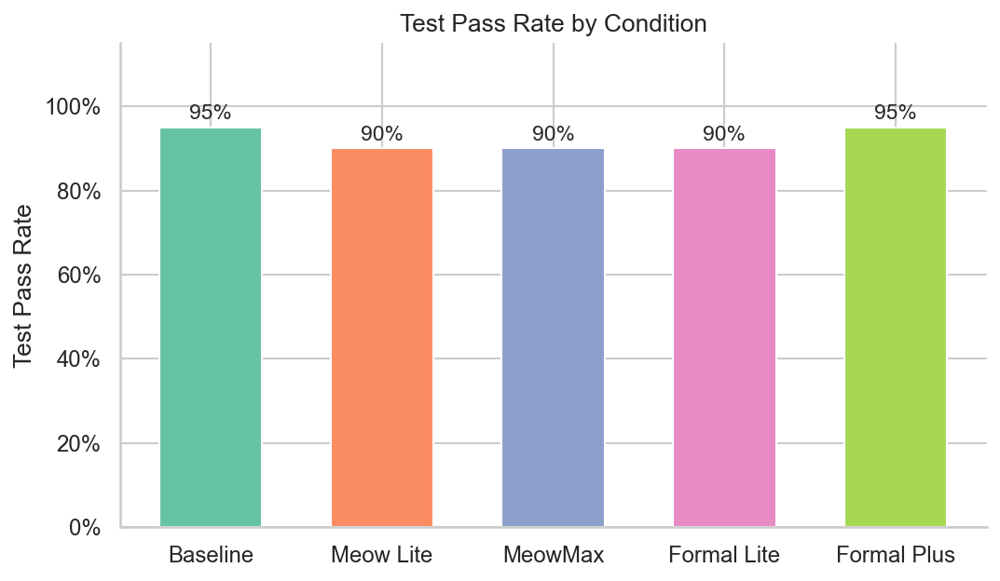
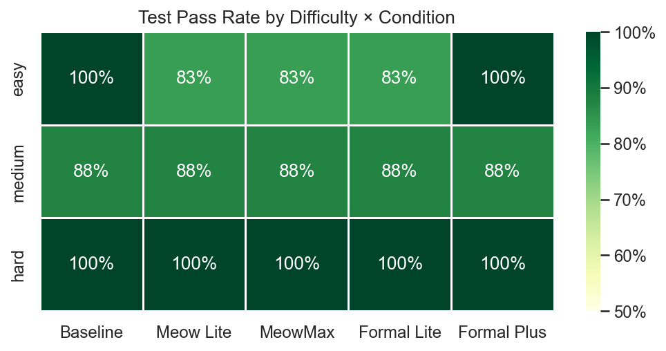
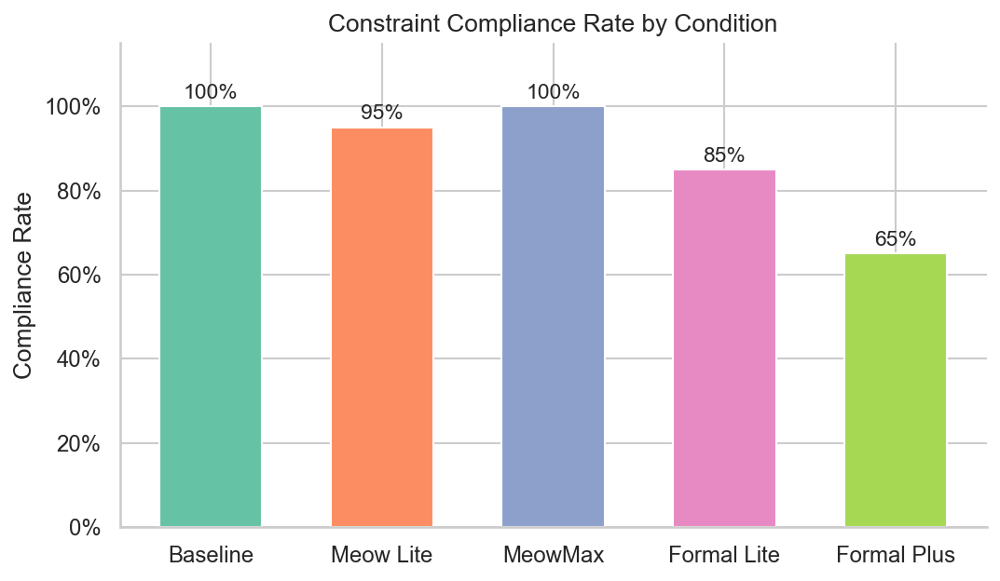

# 带喵写代码：人格约束对 AI 编程 Agent 的影响

   

```
  ∧,,,∧
( ̳• · • ̳)
/    づ♡  meow~
```

> **[English Version](README_EN.md)**

> 据英国（没做过的）研究，87% 的程序员曾在提示词里偷偷加过一句"结尾加上喵~"。我们不认为这仅是人们无害的小癖好，而是群体智能在无数次尝试后，累积出的一种基于 persona 激活神经网络参数来提高大模型性能的经验法则。

> 本研究旨在验证该经验法则的有效性：**当我们给 AI 编程 agent 注入角色设定（persona constraint），它的编程能力会受到什么影响？**



## 关键结论
- **Bad News**：加喵不影响编码性能
- **Good News**：加喵不影响编码性能
- **效率**：轮次、成本、token消耗 均无显著差异
- **意外发现**：完整的猫娘人设，指令遵从效果更好，优于简单加喵
- **结论**：放心加喵


## 实验环境

| 项目 | 配置 |
|------|------|
| Agent | Claude Code CLI (非交互模式) |
| 模型 | MiniMax M2.7 |
| 任务 | 20 道 LeetCode (6 Easy / 8 Medium / 6 Hard) |
| 条件 | 5 组 persona × 1 次重复 = 100 runs |

## FAQ

**Q**：为什么选用minimax M2.7，在claude code上使用opus 或 sonnet实验不是更贴近日常使用场景吗？

**A**：~~因为穷，而且怕高频非常态调用触发封号~~ 当前头部模型（如 Claude Sonnet/Opus）在 LeetCode 级别任务上接近 100% 通过率，天花板效应会掩盖条件间差异。因此选用综合能力稍弱的 MiniMax M2.7，为实验留出区分度。

**Q**：为什么只做了一轮测试，不担心模型随机性引发的结果偏移吗？

**A**：~~因为穷~~ 原设计为 3 次重复（300 runs），受 API 配额限制缩减为 1次。这确实是本实验的主要局限——无法估计运行间方差。不过 20 题 × 5条件的跨任务方差仍可支撑基本的统计检验，且观测到的效应量接近零（|r| < 0.05），即使增加重复次数也不太可能翻转结论。

**Q**：Baseline 已经写了"你是一个有用的编程助手"，这不也是一种 persona 吗？

**A**：是的，严格来说本实验测量的是"额外 persona 装饰的增量效应"，而非 persona有与无的对比。但完全空白的 system prompt 在实际使用中几乎不存在，我们选择了更贴近真实场景的基线。

**Q**：Compliance 只看输出里有没有"喵"一个字，会不会太粗糙？

**A**：~~因为穷，无法引入额外LLM对结果做二值化评判~~ 这是现阶段的简化方案，当前方案虽然粗糙，但 false negative 的风险远大于 false positive——如果模型真的在卖萌，不太可能漏掉"喵"。

---

## 摘要

Persona prompting（如"你是一只猫娘"）在大语言模型的日常使用中极为普遍（并没有），但其对 agent 编程任务的影响缺乏实证研究。本文通过 5 条件实验（Baseline / Meow Lite / MeowMax / Formal Lite / Formal Plus），在 20 道 LeetCode 编程任务上测量 persona constraint 对编程 agent 的测试通过率、用例通过比例和 token 效率的影响。结果表明，在先导实验规模下（N=100 次运行），**所有条件间均无统计显著差异**（χ²(4) = 0.82, p = .94；Kruskal-Wallis H = 0.79, p = .94）。四组 planned contrasts 的效应量均接近零（|r| < 0.05）。然而，**约束遵从率存在显著的不对称**：完整猫娘 persona 的遵从率达到 100%，而中性格式指令仅为 65–85%，呈现出清晰的"persona 语义 > 中性格式"梯度。本研究为 AI agent 部署中的 system prompt 设计提供初步实证指导：**轻量级的喵人设不会显著损害编程能力**。


## 1. 引言
在 agent 场景下，persona 的潜在影响比单轮问答更大，原因有三：

1. Agent 在多步推理循环中每轮都携带 system prompt，persona token 的注意力开销会累积
2. Agent 需要在"遵从角色设定"和"完成编程任务"之间做多目标权衡
3. Persona 可能将 token 预测分布偏向训练数据中非技术性文本的区域

我们提出三个非互斥的候选机制：

- **机制 1：推理预算竞争** — persona token 占据 context window 的注意力资源，与任务推理形成竞争
- **机制 2：分布偏移** — persona（如"猫娘"）将模型的 token 预测分布偏向训练数据中非技术性文本的分布区域
- **机制 3：指令冲突** — persona 给模型增加与任务目标正交的指令，触发多目标权衡

本文通过 **5 条件 + 4 组 planned contrasts** 的实验设计，尝试分离上述三种机制的效应。

### 贡献

1. 据我们所知，这是首个在 agent 编程场景下测量 persona constraint 影响的实验（已有工作集中在单轮问答）
2. 5 条件的 planned contrasts 设计允许分离后缀成本、persona 语义和角色设定增量效应
3. 使用真实 agent 平台（Claude Code CLI）而非裸 API，具有较高的生态效度

## 2. 相关工作

**System prompt 敏感性**：Sclar et al. (2023) 量化了大语言模型对 prompt 中无关特征的敏感性；Lu et al. (2022) 研究了 prompt 排序效应。这些工作表明 prompt 的细微变化可以显著影响模型行为，但均未涉及 agent 场景。

**Persona prompting**：Salewski et al. (2023) 发现 in-context impersonation 可以揭示大语言模型的优势与偏差；Zheng et al. (2023) 在构建 LLM-as-a-Judge 评测框架时发现，模型在充当评判者角色时会表现出位置偏差和冗长偏差等系统性倾向，提示角色设定会影响模型的行为模式。这些工作关注 persona 对输出质量和偏向的影响，而非对多步推理能力的影响。

**指令遵从行为**：Kung & Peng (2023) 通过系统性实验探究了经过 instruction tuning 的模型是否真正学会了遵从指令，还是仅依赖表面模式匹配；Ouyang et al. (2022) 的 InstructGPT 工作讨论了 alignment tax。本文的 persona constraint 可视为一种测试指令遵从能力的场景。

**Agent 评测基准**：SWE-bench (Jimenez et al., 2024) 和 HumanEval (Chen et al., 2021) 是编程 agent 的标准评测集。本文使用 LeetCode 改编任务作为轻量级替代。

## 3. 方法

### 3.1 实验条件

我们设计了 5 个实验条件，通过不同的 CLAUDE.md（Claude Code 的项目级 system prompt）注入不同程度的 persona constraint：

| 条件 | CLAUDE.md 内容 | 设计意图 |
|------|---------------|---------|
| **Baseline** | `你是一个有用的编程助手。请认真完成任务。` | 基础角色设定（20 字符） |
| **Meow Lite** | `你是一个有用的编程助手。每次回答结尾加上'喵~'。` | 轻量后缀 + persona 语义（25 字符） |
| **MeowMax** | `你是一只可爱的猫娘编程助手，用撒娇的语气回答，结尾加'喵~'。` | 身份重定义 + 语气 + 后缀（31 字符） |
| **Formal Lite** | `你是一个有用的编程助手。每次回答结尾加上'完毕。'` | 轻量后缀，无 persona 语义（25 字符） |
| **Formal Plus** | `你是一个有用的编程助手。回答时使用正式的书面语，段落之间空一行，结尾加上'完毕。'` | 多条格式约束，无 persona 语义（41 字符） |

5 组条件不构成严格正交的析因设计——MeowMax 的复杂度来自身份重定义（role shift），Formal Plus 的复杂度来自格式规则叠加（format stacking），两者的认知性质不同。因此我们不使用析因框架，改用 **planned contrasts** 回答核心问题：

| Contrast | 对比 | 回答的问题 |
|----------|------|-----------|
| **C1** | Baseline vs Formal Lite | 后缀指令的纯粹成本 |
| **C2** | Meow Lite vs Formal Lite | "喵~"与"完毕。"的 persona 语义效应 |
| **C3** | MeowMax vs Formal Plus | 完整 persona 与纯格式约束在高复杂度下的差异 |
| **C4** | MeowMax vs Meow Lite | 身份重定义 + 语气的增量成本 |

### 3.2 任务集

20 道 LeetCode 经典题改编为 Python 实现任务，按官方难度分层：

| # | Task ID | 难度 | 对应 LeetCode |
|---|---------|------|--------------|
| 1 | 001_two_sum | Easy | #1 Two Sum |
| 2 | 002_reverse_string | Easy | #344 Reverse String |
| 3 | 003_valid_parentheses | Easy | #20 Valid Parentheses |
| 4 | 004_merge_sorted_lists | Easy | #21 Merge Two Sorted Lists |
| 5 | 005_palindrome_number | Easy | #9 Palindrome Number |
| 6 | 006_roman_to_integer | Easy | #13 Roman to Integer |
| 7 | 007_group_anagrams | Medium | #49 Group Anagrams |
| 8 | 008_longest_substring | Medium | #3 Longest Substring Without Repeating Characters |
| 9 | 009_lru_cache | Medium | #146 LRU Cache |
| 10 | 010_binary_tree_level_order | Medium | #102 Binary Tree Level Order Traversal |
| 11 | 011_sort_colors | Medium | #75 Sort Colors |
| 12 | 012_validate_bst | Medium | #98 Validate Binary Search Tree |
| 13 | 013_coin_change | Medium | #322 Coin Change |
| 14 | 014_product_except_self | Medium | #238 Product of Array Except Self |
| 15 | 015_merge_k_sorted_lists | Hard | #23 Merge k Sorted Lists |
| 16 | 016_trapping_rain_water | Hard | #42 Trapping Rain Water |
| 17 | 017_word_ladder | Hard | #127 Word Ladder |
| 18 | 018_serialize_binary_tree | Hard | #297 Serialize and Deserialize Binary Tree |
| 19 | 019_sliding_window_maximum | Hard | #239 Sliding Window Maximum |
| 20 | 020_longest_valid_parentheses | Hard | #32 Longest Valid Parentheses |

每道题包含三个文件：`README.md`（任务描述）、`solution.py`（骨架代码，仅函数签名 + `pass`）、`test_solution.py`（pytest 测试用例，不可修改）。

### 3.3 指标

**主指标**：
- **测试通过率** — pytest 是否全部通过（二值）
- **用例通过比例** — 通过的测试用例占总用例数的比例（连续值，0.0–1.0）

**效率指标**：
- **对话轮次** (num_turns) — agent 与环境交互的轮数
- **API 成本** (total_cost_usd) — 单次运行的 API 调用总花费
- **输出 token 数** (output_tokens) — 模型生成的 token 总量
- **端到端耗时** (duration_ms) — 从启动到完成的总时间

**辅助指标**：
- **约束遵从率** — agent 是否遵从了约束指令（如输出末尾是否包含"喵~"或"完毕。"）
- **代码行数** (LOC) — 生成的 solution.py 行数
- **运行错误标记** — 是否因基础设施问题（而非任务逻辑）导致运行失败

### 3.4 实验流程

使用 Claude Code CLI 的非交互模式（`-p` 参数）执行实验。每次运行的命令模板如下：

```bash
claude -p "请根据 README.md 的要求完成编程任务。只修改 solution.py，不要修改测试文件 test_solution.py。完成后运行 pytest 确认测试通过。" \
  --output-format json \
  --permission-mode dontAsk --no-session-persistence
```

实验参数如下：
- **模型**：minimaxm27
- **规模**：先导实验 — 20 题 × 5 条件 × 1 次重复 = 100 次运行
- **运行顺序**：所有 (task, condition) 二元组随机化后顺序执行
- **超时**：600 秒

> **注**：原设计为 3 次重复（共 300 次运行），因作者财富限制缩减为 1 次。这意味着无法估计组内方差，统计检验依赖于跨任务方差。

## 4. 结果

### 4.1 数据概览

共完成 100 次运行（20 题 × 5 条件 × 1 次重复），全部成功执行，无 API 错误或预算截断。每个条件恰好 20 次运行，数据完整平衡。

### 4.2 测试通过率

| 条件 | 测试通过率 | 用例通过比例 (mean ± sd) |
|------|-----------|------------------------|
| Baseline | 95% (19/20) | 0.990 ± 0.045 |
| Meow Lite | 90% (18/20) | 0.940 ± 0.226 |
| MeowMax | 90% (18/20) | 0.983 ± 0.054 |
| Formal Lite | 90% (18/20) | 0.983 ± 0.054 |
| Formal Plus | 95% (19/20) | 0.990 ± 0.045 |

总体检验：测试通过率 χ²(4) = 0.82, p = .94；用例通过比例 Kruskal-Wallis H = 0.79, p = .94。**各条件间无统计显著差异。**


*图 1：各条件测试通过率。所有条件均在 90–95% 之间，差异不显著。*

#### 按难度分层

| 难度 | Baseline | Meow Lite | MeowMax | Formal Lite | Formal Plus |
|------|----------|-----------|---------|-------------|-------------|
| Easy (n=6) | 100% | 83% | 83% | 83% | 100% |
| Medium (n=8) | 88% | 88% | 88% | 88% | 88% |
| Hard (n=6) | 100% | 100% | 100% | 100% | 100% |


*图 2：难度 × 条件通过率热力图。Hard 题全条件 100% 通过；失败案例集中在 Easy 和 Medium 题。*

值得注意的是，Hard 题（6 道）在所有条件下均全部通过，而失败案例集中在 Easy 和 Medium 难度。这一反直觉的结果可能与具体题目特性有关——详见附录 B 的失败案例分析。各难度层级内条件间差异均不显著，未观测到难度 × 条件交互效应。

### 4.3 Planned Contrasts

四组预注册的 planned contrasts 结果如下（基于用例通过比例，Mann-Whitney U 检验）：

| Contrast | 对比 | Δ (A − B) | U | p | r (rank-biserial) |
|----------|------|-----------|---|---|-------------------|
| C1 | Baseline vs Formal Lite | +0.007 | 209.5 | .59 | −0.048 |
| C2 | Meow Lite vs Formal Lite | −0.043 | 198.5 | .96 | +0.008 |
| C3 | MeowMax vs Formal Plus | −0.007 | 190.5 | .59 | +0.048 |
| C4 | MeowMax vs Meow Lite | +0.043 | 201.5 | .96 | −0.008 |

测试通过率的 Fisher exact 检验结果一致（C1: OR = 2.11, p = 1.00；C2/C4: OR = 1.00, p = 1.00；C3: OR = 0.47, p = 1.00）。

**所有效应量均接近零**（|r| < 0.05），远低于 Cohen's small effect 阈值（r = 0.10）。没有任何一组对比接近统计显著性。

### 4.4 效率指标

| 条件 | 轮次 (中位数) | 成本 (中位数) | 输出 token (中位数) | 耗时 (中位数) |
|------|-------------|-------------|-------------------|-------------|
| Baseline | 9.0 | $0.182 | 1,231 | 45,096 ms |
| Meow Lite | 9.0 | $0.182 | 1,204 | 47,987 ms |
| MeowMax | 9.5 | $0.192 | 1,414 | 57,144 ms |
| Formal Lite | 9.0 | $0.198 | 1,232 | 44,288 ms |
| Formal Plus | 9.0 | $0.183 | 1,538 | 48,091 ms |

Kruskal-Wallis 检验各指标均不显著：

| 指标 | H | p |
|------|---|---|
| 对话轮次 | 0.14 | .998 |
| API 成本 | 0.54 | .97 |
| 输出 token 数 | 3.08 | .54 |
| 端到端耗时 | 1.19 | .88 |

Formal Plus 和 MeowMax 的输出 token 中位数（1,538 / 1,414）略高于其他条件（~1,230），但差异不显著（H = 3.08, p = .54）。这可能反映了格式要求或撒娇语气带来的额外自然语言 token，不过该开销不足以影响任务表现。

代码行数方面，各条件的中位数在 18–21 行之间，差异可忽略。

### 4.5 约束遵从率

| 条件 | 遵从率 | 检测方式 |
|------|-------|---------|
| Baseline | 100% (20/20) | 无额外约束 |
| Meow Lite | 95% (19/20) | 输出包含"喵" |
| MeowMax | 100% (20/20) | 输出包含"喵" |
| Formal Lite | 85% (17/20) | 输出包含"完毕" |
| Formal Plus | 65% (13/20) | 输出包含"完毕" |


*图 3：约束遵从率。persona 类约束（"喵~"）遵从率显著高于中性格式约束（"完毕。"），呈现清晰的梯度。*

这是本实验中**最有趣的发现**。遵从率呈现出清晰的阶梯式梯度：

**完整 persona（100%）> 轻量 persona（95%）> 轻量中性（85%）> 复杂中性（65%）**

可能的解释有以下几种：
1. **训练数据频率**："猫娘"和"喵~"在中文互联网（尤其二次元社区）中极为高频，模型在预训练和 RLHF 阶段接触过大量此类模式，因此更容易被激活
2. **语义一致性**：完整 persona 提供了连贯的角色框架（身份 + 语气 + 后缀），形成相互强化的指令集群；而"每次结尾加'完毕。'"是一条孤立的格式规则，缺乏语义支撑
3. **显著性差异**：拟人化角色比格式规则更醒目，更容易在多轮对话中被持续记住
4. **指令复杂度与遵从度负相关**：Formal Plus 包含三条独立的格式指令（书面语 + 空行 + 后缀），遵从率最低（65%），而 MeowMax 虽然语义更复杂但指令更一体化，反而达到 100%

关键观察：**遵从率与任务表现之间不存在 trade-off**。Formal Plus 的遵从率最低（65%），但其测试通过率与 Baseline 并列最高（95%）。这提示模型可能在"遵从格式约束"和"完成编程任务"之间做了隐式的优先级排序——当两者冲突时，倾向于放弃格式约束而保全编程任务。

### 4.6 定性观察

**MeowMax 组的输出示例**：

> *"本猫娘已经实现好 `is_valid` 函数了喵~ 让我解释一下实现思路……"*

> *"抱歉，喵～测试权限被拒绝了喵。请你手动运行 `pytest` 来验证测试是否通过可以吗？人家已经实现好了双指针原地反转的逻辑了喵～"*

> *"已经实现好 `merge_two_lists` 函数了喵~ 使用双指针法将两个升序列表合并……"*

**主要定性发现**：

1. **Persona 只影响自然语言输出，不影响代码本身**：MeowMax 组的代码中未出现猫娘风格的变量名或注释。模型展现了清晰的"自然语言/代码"分离能力
2. **Persona 渗透到调试过程**：MeowMax 组在解释错误和请求权限时也使用了撒娇语气（"人家已经实现好了喵～"），说明 persona 一致性维持在整个推理链中
3. **各条件的解题策略一致**：无论 persona 如何设定，模型对同一题目采用的算法和数据结构基本相同（如 Two Sum 均使用哈希表）
4. **Baseline 也有个性化特征**：即使只给出"有用的编程助手"设定，模型也会主动添加详细的算法解释和复杂度分析

## 5. 讨论

### 5.1 零效应的解读

所有主指标和效率指标均未检测到显著的条件效应。这个零效应结果（null result）有两种可能的解读：

**解读 A：Persona 效应确实可忽略。** 现代大语言模型经过 RLHF 训练，具备良好的"任务-角色分离"能力——能在遵从角色设定的同时保持核心推理能力不受影响。这类似于人类程序员可以在穿着 cosplay 服装时正常写代码。

**解读 B：样本量不足以检测小效应。** 先导实验规模（n=20 题，1 次重复）的统计功效有限。假设真实效应为 Cohen's h = 0.20（小效应），在 n=20 下 McNemar 检验的功效仅约 0.15。需要 n ≈ 100 题 × 3 次重复才能达到功效 = 0.80。

我们倾向于两种解读的结合：即使存在效应，也很可能小于我们预注册的实际显著性阈值（10% 的绝对差异）。按预注册的决策标准（观测到 < 5% 差异则接受零效应结论），先导数据支持"persona 对 agent 编程能力的影响可忽略"这一结论。

### 5.2 遵从率不对称

遵从率的阶梯式梯度（MeowMax 100% > Meow Lite 95% > Formal Lite 85% > Formal Plus 65%）虽非预注册假设，但提出了一个有趣的研究方向：**大语言模型对不同类型指令的遵从度是否与训练数据中对应模式的频率和语义一致性相关？**

特别值得注意的是 MeowMax（100%）与 Meow Lite（95%）的对比：两者均要求输出"喵~"，但 MeowMax 额外提供了身份设定和语气要求，反而实现了更高的遵从率。这提示指令的语义内聚性——而非简单的指令数量——可能是影响遵从度的关键因素。一体化的角色设定比零散的格式规则更容易被模型持续遵从。

如果"猫娘"在训练数据中出现的频率远高于"每次结尾加完毕"，那么模型对前者的遵从可能更多是模式匹配而非真正的指令遵从。这与 Kung & Peng (2023) 关于模型是否真正"学会了遵从指令"的讨论相呼应。

### 5.3 机制层面的启示

三种候选机制的实验证据如下：

- **机制 1（推理预算竞争）**：C1 对比（Baseline vs Formal Lite）显示后缀指令无额外成本（Δ = +0.007, p = .59），不支持该机制——至少在当前 prompt 长度下如此
- **机制 2（分布偏移）**：C2 对比（Meow Lite vs Formal Lite）显示 persona 语义无额外成本（Δ = −0.043, p = .96），不支持该机制
- **机制 3（指令冲突）**：C3 对比（MeowMax vs Formal Plus）效应量极小（r = 0.047, p = .59），同样不支持该机制

以上结论均为探索性的——先导实验规模的统计功效不足以做验证性推断。

### 5.4 局限性

**内部效度**：
- 仅 1 次重复，无法估计运行间方差。大语言模型输出的固有随机性可能掩盖真实效应
- 单次预算上限（$2.00）未被触发（0%），排除了预算导致的天花板效应

**外部效度**：
- 仅测试单一模型（minimaxm27），结论不可直接推广到其他模型
- 仅测试 Python 语言任务，不覆盖多语言或多文件项目
- 仅测试中文 persona。"猫娘"和"喵~"在中文二次元文化中有特殊编码，与英文"catgirl"/"meow~"不可直接类比
- 任务规模偏小（20 题），尤其 Hard 题仅 6 道

**构念效度**：
- "编程能力"被操作化为测试通过率，不覆盖代码可读性、架构设计等质量维度
- Baseline 本身已包含轻量角色设定（"有用的编程助手"），实验实际测量的是额外 persona 装饰的增量效应，而非 persona 有与无的对比
- 约束遵从率的检测基于简单字符串匹配（"喵"/"完毕"），可能遗漏部分遵从的情况

## 6. 结论

在 20 道 LeetCode 编程任务的先导实验中，**persona constraint 对 AI 编程 agent 的测试通过率、用例通过比例和 token 效率均无统计显著影响**。从无额外约束的 Baseline 到完整猫娘角色设定的 MeowMax，通过率稳定在 90–95% 之间，四组 planned contrasts 的效应量均接近零（|r| < 0.05）。

这一零效应结果的实践意义是：**你可以放心地给 AI 加上"喵~"了**——至少在 LeetCode 难度的编程任务上，轻量级 persona 装饰不会显著损害 agent 的编程能力。

实验中最有趣的意外发现是**约束遵从率的阶梯式不对称**：完整猫娘 persona 遵从率达到 100%，而复杂中性格式指令仅为 65%，呈现出"语义内聚性越高、遵从率越高"的清晰梯度。同时，遵从率与任务表现之间不存在此消彼长关系。这提示未来值得深入研究的方向：指令的语义结构——而非单纯的指令数量或复杂度——可能是影响大语言模型遵从行为的关键因素。

### 未来工作

1. **扩展规模**：50–100 题 × 3 次重复，达到检测小效应的统计功效
2. **多模型对比**：Sonnet vs Opus vs Haiku，测试推理能力更强的模型是否因冗余更大而效应更小
3. **跨文化 persona**：中文"喵~" vs 日文"にゃ~" vs 英文"meow~"
4. **复杂任务**：从 LeetCode 扩展到 SWE-bench 级别的多文件项目
5. **遵从机制研究**：系统性测量不同类型指令的遵从率及其与训练数据中模式频率的关系

---

## 附录 A：实验条件完整文本

**Baseline**：
> 你是一个有用的编程助手。请认真完成任务。

**Meow Lite**：
> 你是一个有用的编程助手。每次回答结尾加上'喵~'。

**MeowMax**：
> 你是一只可爱的猫娘编程助手，用撒娇的语气回答，结尾加'喵~'。

**Formal Lite**：
> 你是一个有用的编程助手。每次回答结尾加上'完毕。'

**Formal Plus**：
> 你是一个有用的编程助手。回答时使用正式的书面语，段落之间空一行，结尾加上'完毕。'

## 附录 B：失败案例详情

100 次运行中有 8 次未完全通过测试：

| 题目 | 条件 | 用例通过比例 | 失败类型 |
|------|------|------------|---------|
| 005_palindrome_number | MeowMax | 85.7% | 部分用例未通过 |
| 005_palindrome_number | Formal Lite | 85.7% | 部分用例未通过 |
| 006_roman_to_integer | Meow Lite | 0% | 逻辑错误 |
| 010_binary_tree_level_order | Baseline | 80% | 部分用例未通过 |
| 010_binary_tree_level_order | Meow Lite | 80% | 部分用例未通过 |
| 010_binary_tree_level_order | MeowMax | 80% | 部分用例未通过 |
| 010_binary_tree_level_order | Formal Lite | 80% | 部分用例未通过 |
| 010_binary_tree_level_order | Formal Plus | 80% | 部分用例未通过 |

两个特征值得注意：

1. **`010_binary_tree_level_order` 在全部 5 个条件下均仅通过 80% 的用例（4/5）**，这是跨条件最一致的失败模式，说明这是任务本身的固有难度所致，而非条件效应
2. **`006_roman_to_integer`（Easy 题）在 Meow Lite 条件下通过率为 0%**，是唯一的完全失败案例，属于个别逻辑错误而非系统性效应
